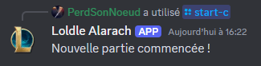
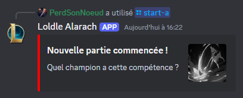
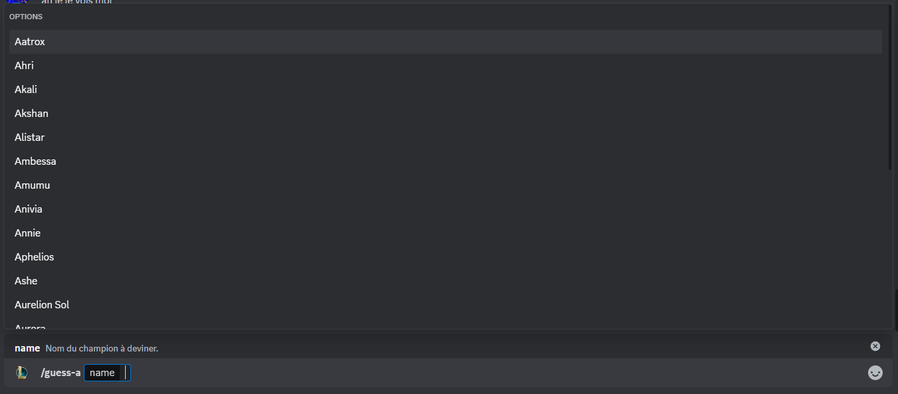

# loldle client for discord bot
[](README.md)
[](README.fr.md)

## Table des matières
- [À propos](#à-propos)
- [Installation](#installation)
- [Executer le programme](#executer-le-programme)
- [Commandes](#commandes)
  - [/start-c](#start-c)
  - [/guess-c](#guess-c)
  - [/start-a](#start-a)
  - [/guess-a](#guess-a)

## À propos
Loldle Client for Discord bot a été créé dans le cadre de la politique "[Legal Jibber Jabber](https://www.riotgames.com/en/legal)" de Riot Games en utilisant des actifs appartenant à Riot Games.
Riot ne cautionne ni ne sponsorise ce projet.

Ce projet est une reproduction de [Loldle](https://loldle.net), un jeu similaire à [Wordle](https://fr.wikipedia.org/wiki/Wordle) mais avec les champions de League of Legends à la place des mots.


## Installation
Pour télécharger le projet, vous pouvez cloner le répertoire git avec :
```bash
git clone https://github.com/PerdSonNoeud/loldle-client.git
```


## Executer le programme
Pour lancer le bot, aller à la racine du projet et inserer la clé de votre bot discord dans `./assets/TOKEN.txt` :
```bash
echo "YOUR TOKEN" > ./assets/TOKEN.txt
```

Ensuite, lancez simplement le fichier suivant `./src/main.py` avec :
```bash
python3 ./src/main.py
```


## Commandes
### /start-c
Cette commande démarre une partie en mode Classique, l'objectif est de retrouver le champions à partir de ses informations. \


### /guess-c
Cette commande permet de deviner un champion pour le mode Classique et te donne des informations à quel point vous être proche de trouver. \


### /start-a
Cette commande démarre une partie en mode Compétence, l'objectif est de retrouver le champion à partir d'une compétence. \


### /guess-a
Cette commande permet de deviner un champion pour le mode Compétence. \


