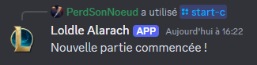
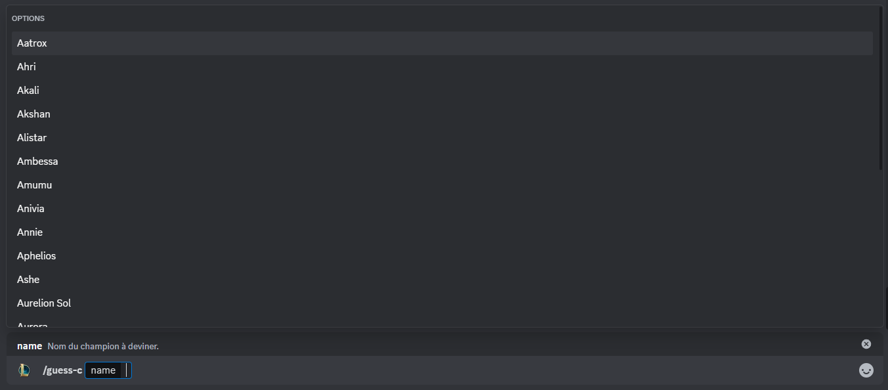
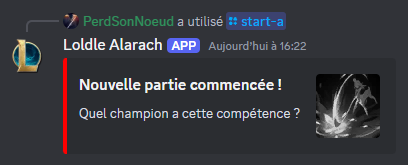
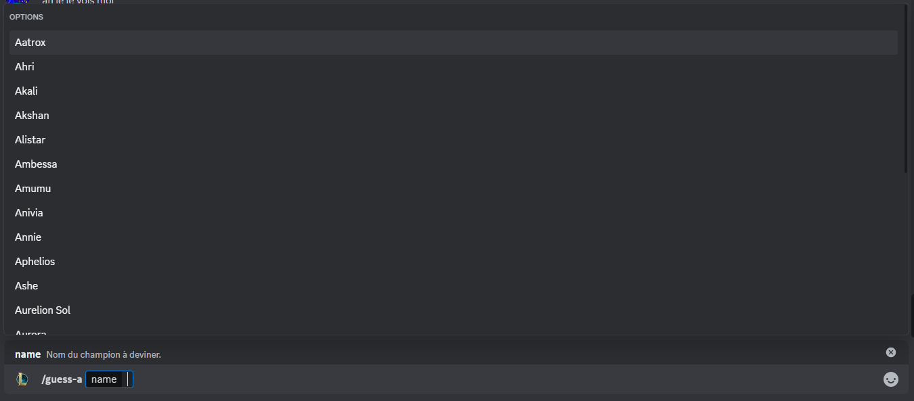

# loldle client for discord bot
[](README.md)
[](README.fr.md)

## Table of Contents
- [About](#about)
- [Installation](#installation)
- [Execute Program](#execute-program)
- [Commands](#commands)
  - [/start-c](#start-c)
  - [/guess-c](#guess-c)
  - [/start-a](#start-a)
  - [/guess-a](#guess-a)

## About
Loldle Client for Discord bot was created under Riot Games' "[Legal Jibber Jabber](https://www.riotgames.com/en/legal)" policy using assets owned by Riot Games.
Riot Games does not endorse or sponsor this project.

This project is a reproduction of [Loldle](https://loldle.net), a game similar to [Wordle](https://en.wikipedia.org/wiki/Wordle) but with the champions of League of legends instead of words.

## Installation
To download this project, you can clone this git repository using :
```bash
git clone https://github.com/PerdSonNoeud/loldle-client.git
```

## Execute program
To start the bot, go to the root of the project and insert your discord bot token into `./assets/TOKEN.txt` :
```bash
echo "YOUR TOKEN" > ./assets/TOKEN.txt
```

Then, you can simply run the file `./src/main.py` using:
```bash
python3 ./src/main.py
```

## Commands
### /start-c
This command starts a game in the Classic mode, where you guess the champion based of the information about him. \


### /guess-c
This command allows you guess a champion and gives you information about how close you are to the right champion. \


### /start-a
This command starts a game in the Ability mode, where you guess the champion that has this ability. \


### /guess-a
This command allows you guess a champion for the ability mode. \


### /start-s
This command starts a game in the Splash Art mode, where you guess the champion based of a part of his splash art. \


### /guess-s
This command allows you guess a champion for the splash art mode. \

